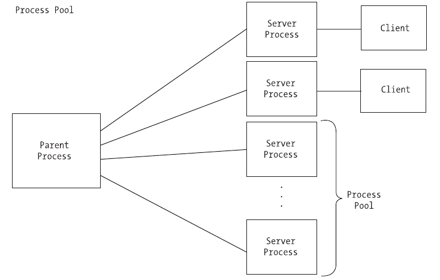
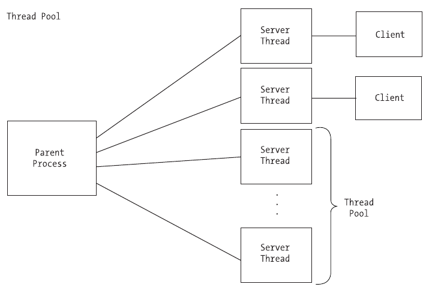

# Pemrograman Soket - Paralelisme

**Tujuan**: mahasiswa akan dapat membuat program soket multikoneksi pada Linux

Pada praktikum sebelumnya, telah dibuat aplikasi server yang hanya bisa melayani satu klien tiap satu waktu. Aplikasi server ini kurang berguna pada dunia nyata. Klien lain harus menunggu lama untuk dapat dilayani oleh server. Untuk mengatasinya, aplikasi server biasanya menggunakan arsitektur paralel, baik menggunakan multiprocessing, multithreading, maupun kombinasi keduanya.

Contoh aplikasi server pada dunia nyata adalah Apache HTTP server, yang memiliki beberapa MPM (multi-processing module). Dua MPM yang paling banyak digunakan:

- `prefork`: menggunakan multiprocessing, memerlukan lebih banyak memori, memiliki banyak fitur, biasa dipakai bersama dengan modul PHP
- `worker`: hibrida, gabungan antara multiprocessing dan multithreading, lebih ringan tetapi fiturnya terbatas


## Multi-Processing



- satu proses melayani satu klien
- menggunakan `fork()` untuk menduplikasi proses
- keuntungan:
      - implementasinya sederhana
      - jika salah satu proses child crash, proses lain tidak terpengaruh
- kerugian:
      - komunikasi antar-proses tidak efisien
      - memerlukan banyak resource untuk membuat proses baru
- proses parent harus memanggil `wait()` untuk menunggu sampai proses child selesai, supaya tidak terjadi proses zombie
- contoh implementasi: prefork (proses child dibuat terlebih dahulu sebanyak jumlah tertentu)
- kompilasi dan coba jalankan beberapa klien sekaligus yang mengakses server

```c
#include <stdio.h>
#include <stdlib.h>
#include <unistd.h>
#include <arpa/inet.h>
#include <sys/wait.h>

#define NPROCESS 3

int main(int argc, char *argv[])
{
    int port = atoi(argv[1]);                       /* port server */
    int i, server_id = 0, client_id = 0;

    /* 1. Membuat soket */
    int listen_socket = socket(AF_INET, SOCK_STREAM, 0);
    if (listen_socket == -1) {
        fprintf(stderr, "Error creating socket.\n");
        exit(EXIT_FAILURE);
    }

    struct sockaddr_in server_addr = {              /* alamat server */
        .sin_family = AF_INET,
        .sin_port = htons(port),
        .sin_addr.s_addr = INADDR_ANY
    };

    /* 2. Memberikan alamat ke soket */
    if (bind(listen_socket, (struct sockaddr*) &server_addr, sizeof (struct sockaddr_in)) == -1) {
        fprintf(stderr, "Error binding.\n");
        exit(EXIT_FAILURE);
    }

    /* 3. Listen --> soket pasif */
    if (listen(listen_socket, 5) == -1) {
        fprintf(stderr, "Error listening.\n");
        exit(EXIT_FAILURE);
    }
    printf("[SERVER] listening...\n");

    /* 4. Prefork sebanyak jumlah proses yang diinginkan */
    for (i = 0; i < NPROCESS; i++) {
        printf("[SERVER] creating child-%d\n", i);
        if (fork() == 0) {                          /* jika proses anak, maka akan menerima koneksi dari klien */
            server_id = i;
            while (1) {
                struct sockaddr_in client_addr;             /* alamat klien */
                socklen_t client_addr_size = sizeof (struct sockaddr_in);

                /* 5. Membuat soket untuk menerima koneksi dari klien */
                int accept_socket = accept(listen_socket, (struct sockaddr*) &client_addr, &client_addr_size);
                if (accept_socket == -1) {
                    fprintf(stderr, "Error accepting accept_socket.\n");
                    exit(EXIT_FAILURE);
                }
                client_id++;

                /* cetak alamat klien */
                printf("[SERVER] child-%d accepting client-%d.%d from %s:%d\n", server_id, server_id, client_id, inet_ntoa(client_addr.sin_addr), ntohs(client_addr.sin_port));

                /* kirim pesan ke klien */
                char server_msg[] = "+OK Welcome, type your message.\n";
                write(accept_socket, server_msg, sizeof server_msg);

                /* baca pesan dari klien */
                char client_msg[100] = {0};
                read(accept_socket, client_msg, sizeof client_msg);
                printf("[CLIENT] client-%d.%d said: %s", server_id, client_id, client_msg);

                /* balas pesan ke klien */
                char server_reply[] = "+OK Message accepted. Bye!\n";
                write(accept_socket, server_reply, sizeof server_reply);

                /* 6. Tutup koneksi klien */
                close(accept_socket);
            }
        }
    }
    wait(NULL);                                     /* parent menunggu sampai child selesai */

    /* tutup soket */
    close(listen_socket);
    exit(EXIT_SUCCESS);
}
```


## Multi-Threading



- satu thread melayani satu klien
- menggunakan `pthread_create()` untuk membuat thread baru
- thread adalah _lighweight process_ yang berbagi pakai memori utama dengan proses parent
- keuntungan:
      - thread menggunakan _resource_ yang lebih sedikit
      - thread memiliki waktu _context-switch_ yang lebih cepat
- kerugian
      - aplikasi multi-thread kurang stabil dibandingkan dengan aplikasi multi-proses
      - karena ruang memori dipakai bersama, satu thread yang crash akan mempengaruhi thread lain
- contoh implementasi: prethread (thread dibuat terlebih dahulu sebanyak jumlah tertentu)
- kompilasi dengan menambahkan opsi `-pthread` dan jalankan beberapa klien sekaligus untuk mengakses server

```c
#include <stdio.h>
#include <stdlib.h>
#include <unistd.h>
#include <arpa/inet.h>
#include <pthread.h>

#define NTHREAD 3

int i, client_id = 0;

void *accept_connection(void *arg);

int main(int argc, char *argv[])
{
    int port = atoi(argv[1]);                       /* port server */
    pthread_t thread[NTHREAD];

    /* 1. Membuat soket */
    int listen_socket = socket(AF_INET, SOCK_STREAM, 0);
    if (listen_socket == -1) {
        fprintf(stderr, "Error creating socket.\n");
        exit(EXIT_FAILURE);
    }

    struct sockaddr_in server_addr = {              /* alamat server */
        .sin_family = AF_INET,
        .sin_port = htons(port),
        .sin_addr.s_addr = INADDR_ANY
    };

    /* 2. Memberikan alamat ke soket */
    if (bind(listen_socket, (struct sockaddr*) &server_addr, sizeof (struct sockaddr_in)) == -1) {
        fprintf(stderr, "Error binding.\n");
        exit(EXIT_FAILURE);
    }

    /* 3. Listen --> soket pasif */
    if (listen(listen_socket, 5) == -1) {
        fprintf(stderr, "Error listening.\n");
        exit(EXIT_FAILURE);
    }
    printf("[SERVER] listening...\n");

    /* 4. Pre-threading */
    for (i = 0; i < NTHREAD; i++) {
        printf("[SERVER] creating thread-%d\n", i);
        pthread_create(&thread[i], NULL, accept_connection, (void *)&listen_socket);
        sleep(1);
    }
    for (i = 0; i < NTHREAD; i++) {                 /* parent menunggu sampai tiap thread selesai */
        pthread_join(thread[i], NULL);
    }

    /* tutup soket */
    close(listen_socket);
    exit(EXIT_SUCCESS);
}

void *accept_connection(void *arg)
{
    int listen_socket = *(int *)arg;
    int tid = i;

    while (1) {
        struct sockaddr_in client_addr;             /* alamat klien */
        socklen_t client_addr_size = sizeof (struct sockaddr_in);

        /* 5. Membuat soket untuk menerima koneksi dari klien */
        int accept_socket = accept(listen_socket, (struct sockaddr*) &client_addr, &client_addr_size);
        if (accept_socket == -1) {
            fprintf(stderr, "Error accepting accept_socket.\n");
            exit(EXIT_FAILURE);
        }
        int cid = client_id++;

        /* cetak alamat klien */
        printf("[SERVER] thread-%d accepting client-%d from %s:%d\n", tid, cid, inet_ntoa(client_addr.sin_addr), ntohs(client_addr.sin_port));

        /* kirim pesan ke klien */
        char server_msg[] = "+OK Welcome, type your message.\n";
        write(accept_socket, server_msg, sizeof server_msg);

        /* baca pesan dari klien */
        char client_msg[100] = {0};
        read(accept_socket, client_msg, sizeof client_msg);
        printf("[CLIENT] client-%d said: %s", cid, client_msg);

        /* balas pesan ke klien */
        char server_reply[] = "+OK Message accepted. Bye!\n";
        write(accept_socket, server_reply, sizeof server_reply);

        /* 6. Tutup koneksi klien */
        close(accept_socket);
    }
}
```

## Hybrid (Prefork - Prethread)

```c
#include <stdio.h>
#include <stdlib.h>
#include <unistd.h>
#include <arpa/inet.h>
#include <sys/wait.h>
#include <pthread.h>

#define NPROCESS 3
#define NTHREAD  3

int i, j, server_id, client_id = 0;

void *accept_connection(void *arg);

int main(int argc, char *argv[])
{
    int port = atoi(argv[1]);                       /* port server */
    pthread_t thread[NTHREAD];

    /* 1. Membuat soket */
    int listen_socket = socket(AF_INET, SOCK_STREAM, 0);
    if (listen_socket == -1) {
        fprintf(stderr, "Error creating socket.\n");
        exit(EXIT_FAILURE);
    }

    struct sockaddr_in server_addr = {              /* alamat server */
        .sin_family = AF_INET,
        .sin_port = htons(port),
        .sin_addr.s_addr = INADDR_ANY
    };

    /* 2. Memberikan alamat ke soket */
    if (bind(listen_socket, (struct sockaddr*) &server_addr, sizeof (struct sockaddr_in)) == -1) {
        fprintf(stderr, "Error binding.\n");
        exit(EXIT_FAILURE);
    }

    /* 3. Listen --> soket pasif */
    if (listen(listen_socket, 5) == -1) {
        fprintf(stderr, "Error listening.\n");
        exit(EXIT_FAILURE);
    }
    printf("[SERVER] listening...\n");

    /* 4a. Preforking sebanyak jumlah proses yang diinginkan */
    for (i = 0; i < NPROCESS; i++) {
        printf("[SERVER] creating child-%d\n", i);
        if (fork() == 0) {                          /* jika proses anak, akan melakukan prethreading */

            /* 4b. Prethreading, tiap thread menerima koneksi dari klien */
            for (j = 0; j < NTHREAD; j++) {
                printf("[SERVER] child-%d creating thread-%d%d\n", i, i, j);
                pthread_create(&thread[j], NULL, accept_connection, (void *)&listen_socket);
                sleep(1);
            }
            for (j = 0; j < NTHREAD; j++) {                 /* parent menunggu sampai tiap thread selesai */
                pthread_join(thread[j], NULL);
            }
        }
    }
    wait(NULL);


    /* tutup soket */
    close(listen_socket);
    exit(EXIT_SUCCESS);
}

void *accept_connection(void *arg)
{
    int listen_socket = *(int *)arg;
    int tid = i;

    while (1) {
        struct sockaddr_in client_addr;             /* alamat klien */
        socklen_t client_addr_size = sizeof (struct sockaddr_in);

        /* 5. Membuat soket untuk menerima koneksi dari klien */
        int accept_socket = accept(listen_socket, (struct sockaddr*) &client_addr, &client_addr_size);
        if (accept_socket == -1) {
            fprintf(stderr, "Error accepting accept_socket.\n");
            exit(EXIT_FAILURE);
        }
        int cid = client_id++;

        /* cetak alamat klien */
        printf("[SERVER] thread-%d accepting client-%d from %s:%d\n", tid, cid, inet_ntoa(client_addr.sin_addr), ntohs(client_addr.sin_port));

        /* kirim pesan ke klien */
        char server_msg[] = "+OK Welcome, type your message.\n";
        write(accept_socket, server_msg, sizeof server_msg);

        /* baca pesan dari klien */
        char client_msg[100] = {0};
        read(accept_socket, client_msg, sizeof client_msg);
        printf("[CLIENT] client-%d said: %s", cid, client_msg);

        /* balas pesan ke klien */
        char server_reply[] = "+OK Message accepted. Bye!\n";
        write(accept_socket, server_reply, sizeof server_reply);

        /* 6. Tutup koneksi klien */
        close(accept_socket);
    }
}

```

## Multithreading (Python)


*Thread on demand*, setiap ada koneksi masuk, server akan membuat satu *thread* untuk melayaninya.

```python
import socket
import sys
from thread import *

HOST = ''
PORT = 2001

s = socket.socket(socket.AF_INET, socket.SOCK_STREAM)
print 'Socket created'

s.bind((HOST, PORT))
print 'Socket bind complete'

s.listen(5)
print 'Socket now listening'

def clientthread(conn):
    conn.send('+OK Welcome, type your message.\n');

    data = conn.recv(80)
    print 'Client said: ' + data

    reply = '+OK Message accepted. Bye!\n'
    conn.send(reply)

    conn.close()

while 1:
    conn, addr = s.accept()
    print 'Connected with ' + addr[0] + ':' + str(addr[1])

    start_new_thread(clientthread ,(conn,))

s.close()
```

## Tugas

Sebutkan 10 aplikasi server dan cari tahu metode paralel apa yang dipakai:
- multiprocessing
- multithreading
- hybrid (multiprocessing + multithreading)
