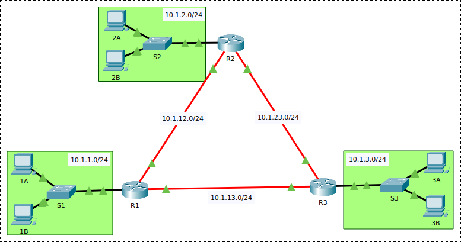

# Routing Dinamis: OSPF

Ada dua cara bagaimana algoritme *routing* dinamis bekerja, yaitu
*distance-vector* (contoh: RIP, EIGRP) dan *link-state* (contoh: OSPF, IS-IS).
Perbedaan antara keduanya dapat dibaca lebih lanjut pada halaman berikut:

- Jenis protokol *routing*^[<http://www.ciscopress.com/articles/article.asp?p=2180210&seqNum=7>]
- Protokol *distance vector* dan *link state*^[<https://www.youtube.com/watch?v=ygxBBMztT4U>]

)](etc/13/dyn-routing.jpg)

## *Open Shortest Path First* (OSPF)

OSPF adalah protokol berbasis *link-state* yang paling populer. *Shortest path
first* mengacu pada nama algoritme yang dipakai dalam menentukan rute
terpendek; sedangkan *open* menandakan bahwa protokol ini bersifat terbuka.
[RFC 2328](https://tools.ietf.org/html/rfc2328) mendefinisikan protokol dasar
OSPF dan [RFC 5340](https://tools.ietf.org/html/rfc5340) menambahkan dukungan
untuk IPv6.

OSPF adalah protokol handal yang baik untuk topologi yang besar dan kompleks.
Keunggulannya dibandingkan dengan RIP antara lain kemampuan mengatur beberapa
jalur ke satu tujuan dan kemampuan mempartisi jaringan menjadi bagian (*area*)
untuk mengurangi beban *router* dalam meng-*update* tabel *routing*.

## *Routing* Dinamis dengan OSPF

*Routing* dengan OSPF dapat dibagi menjadi beberapa area.
Pada contoh berikut, hanya digunakan satu area, yaitu `area 0`.

- siapkan tiga *router*: R1, R2, dan R3, hubungkan dengan kabel fiber
- siapkan jaringan lokal untuk tiap *router*: `10.1.1.0/24`, `10.1.2.0/24`, dan `10.1.3.0/24`

### Konfigurasi *router* R1

- set IP *router* R1 yang terhubung ke LAN dan set servis DHCP

    ~~~
    enable
    configure terminal
      hostname R1

      interface FastEthernet 0/0
        ip address 10.1.1.1 255.255.255.0
        no shutdown
        exit
      ip dhcp pool NET1
        network 10.1.1.0 255.255.255.0
        default-router 10.1.1.1
        exit
      ip dhcp excluded-address 10.1.1.1 10.1.1.100
    ~~~

- set IP router R1 yang terhubung dengan *router* lainnya

    ~~~
      interface FastEthernet 4/0
        ip address 10.1.12.1 255.255.255.0
        no shutdown
        exit
      interface FastEthernet 5/0
        ip address 10.1.13.1 255.255.255.0
        no shutdown
        exit
    ~~~

- konfigurasi OSPF pada tabel *routing*, tambahkan _**semua jaringan dalam satu area**_
    *routing* yang R1 terlibat di dalamnya, misalnya `10.1.*.*` yaitu `10.1.0.0/16`
    - perhatikan notasi *wildcard* adalah kebalikan dari notasi *subnet mask*

    ~~~
      router ospf 1
        network 10.1.0.0 0.0.255.255  area 0
    ~~~

- jangan kirim *update* OSPF ke *interface* jaringan lokal, kirimkan ke sesama
  *router* saja

    ~~~
        passive-interface FastEthernet 0/0
        end
    ~~~

- simpan konfigurasi, lalu lanjutkan dengan konfigurasi R2 dan R3

    ~~~
    copy running-config startup-config
    ~~~

### Konfigurasi *router* R2

~~~
enable
configure terminal
  hostname R2

  interface FastEthernet 0/0
    ip address 10.1.2.1 255.255.255.0
    no shutdown
    exit
  interface FastEthernet 5/0
    ip address 10.1.12.2 255.255.255.0
    no shutdown
    exit
  interface FastEthernet 4/0
    ip address 10.1.23.2 255.255.255.0
    no shutdown
    exit
  ip dhcp pool NET2
    network 10.1.2.0 255.255.255.0
    default-router 10.1.2.1
    exit
  ip dhcp excluded-address 10.1.2.1 10.1.2.100

  router ospf 1
    network 10.1.0.0 0.0.255.255  area 0
    passive-interface FastEthernet 0/0
    end

copy running-config startup-config
~~~

### Konfigurasi *router* R3

~~~
enable
configure terminal
  hostname R3

  interface FastEthernet 0/0
    ip address 10.1.3.1 255.255.255.0
    no shutdown
    exit
  interface FastEthernet 4/0
    ip address 10.1.13.3 255.255.255.0
    no shutdown
    exit
  interface FastEthernet 5/0
    ip address 10.1.23.3 255.255.255.0
    no shutdown
    exit
  ip dhcp pool NET3
    network 10.1.3.0 255.255.255.0
    default-router 10.1.3.1
    exit
  ip dhcp excluded-address 10.1.3.1 10.1.3.100

  router ospf 1
    network 10.1.0.0 0.0.255.255  area 0
    passive-interface FastEthernet 0/0
    exit

copy running-config startup-config
~~~

### Pengujian

- Cek koneksi antara ketiga jaringan tersebut (mode *realtime* dan simulasi)
- Cek isi tabel *routing* tiap *router* dengan perintah `show ip route`
- Cek detail protokol dengan perintah `show ip protocols`
- Cek tetangga *router* dengan perintah `show ip ospf neighbor`

## Tugas

Tambahkan satu *router* baru R4 yang tersambung ke R2, R3, dan jaringan baru NET4 `10.1.4.0/24`.
Gunakan *routing* dinamis OSPF dan pastikan semua jaringan tersambung.

Ambil *screenshot* dan kumpulkan ke LMS dengan ketentuan sebagai berikut:

- berikan label nama dan NIM anda
- tampilkan tabel *routing* R1, R2, R3, dan R4
- tampilkan skenario uji pengiriman paket dari NET1 ke NET2, 3, dan 4
- format PNG atau JPEG

## Referensi

Lihat dokumentasi lengkapnya di halaman berikut: *configuring OSPF*^[<https://www.cisco.com/c/en/us/td/docs/ios-xml/ios/iproute_ospf/configuration/15-mt/iro-15-mt-book/iro-cfg.html>].

